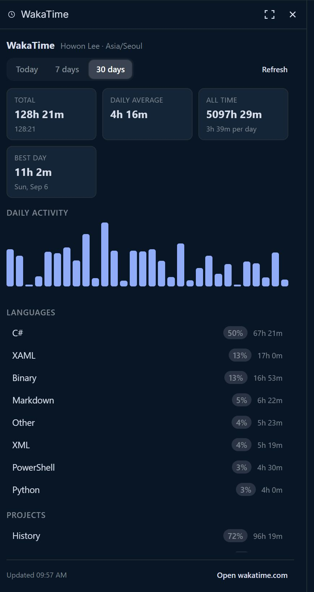
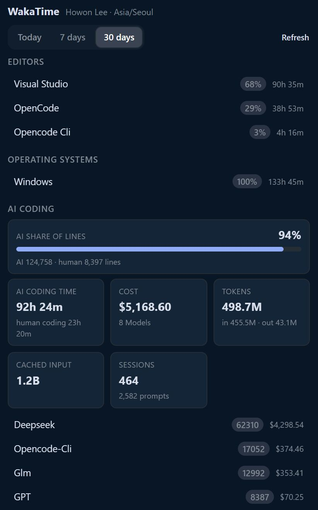

# OpenChamber WakaTime

🌐 [English](README.md) | 한국어

[OpenChamber](https://openchamber.dev)의 오른쪽 레일에 표시되는 WakaTime 패널입니다. 에디터를 벗어나지 않고 코딩 활동을 확인할 수 있습니다. 오늘 작업 시간, 일별 그래프, 언어와 프로젝트 순위, 에디터와 운영체제, 그리고 WakaTime이 집계하는 AI 코딩 비용까지 보여줍니다.

이 패널은 WakaTime 플러그인이 기록하는 `~/.wakatime.cfg`에서 API 키를 읽으므로, OpenChamber에 따로 토큰을 붙여넣을 필요가 없습니다.

## 스크린샷

<p align="center">
  
  
</p>

## 요구 사항

- OpenChamber `2.0.0` 이상이며, 웹 또는 데스크톱에서 동작합니다.
- OpenChamber 서버를 실행하는 컴퓨터에 `~/.wakatime.cfg` 파일이 있어야 하고, `[settings]` 섹션에 `api_key`가 들어 있어야 합니다. 공식 WakaTime 플러그인으로 로그인하면 이 파일이 만들어집니다.

```ini
[settings]
api_key = waka_xxxxxxxx-xxxx-xxxx-xxxx-xxxxxxxxxxxx
```

설정 파일이 없으면 패널이 어떤 경로를 확인했는지와 API 키 발급 링크를 함께 보여줍니다.

## 설치

**폴더에서 설치**(개발용): **설정 → 확장**을 열고 이 폴더의 절대 경로를 붙여 넣은 뒤 **Add**를 선택합니다.

**Git에서 설치**(업데이트용): `https://github.com/airtaxi/openchamber-wakatime`을 붙여 넣고 **Add**를 선택합니다. OpenChamber는 저장소를 자체 데이터 폴더로 복사해서 실행하므로, 빌드된 `panel/main.js`와 `service/main.js`가 저장소에 커밋되어 있어야 합니다. 업데이트는 **설정 → 확장**에서 확인할 수 있습니다.

두 방식 모두 설치할 때 권한 목록이 한 번 표시됩니다. 이 확장은 **로컬 서비스**를 선언하므로, 해당 프로세스가 사용자 권한으로 실행된다는 경고가 함께 나옵니다. 승인하면 레일에 WakaTime 아이콘이 나타납니다.

## 로컬 서비스를 사용하는 이유

패널은 샌드박스 iframe에서 실행되므로 네트워크에 직접 접근할 수 없습니다. 또한 호스트는 통합 카드에 직접 붙여넣은 토큰만 요청에 실어 줍니다. 그래서 `~/.wakatime.cfg`를 읽고 `https://api.wakatime.com`을 호출하려면 확장 옆에 작은 프로세스가 필요합니다. OpenChamber가 이 폴더의 `service/main.js`를 자체 런타임으로 실행하고, 패널은 `host.serviceRequest`를 통해 그 프로세스와 통신합니다.

API 키는 패널에 전달되지 않고, 패널은 네트워크에 접근하지 않습니다. 서비스는 `127.0.0.1`에서 수신하며 호스트가 이를 프록시합니다.

## 패널에 표시되는 내용

- 선택한 기간의 누적 시간, 일 평균, 전체 누적, 최고 기록일입니다.
- 최근 7일 또는 30일의 일별 막대 그래프입니다.
- 언어, 프로젝트, 에디터, 운영체제 순위입니다.
- **작업 중**: 지금 열어 둔 OpenChamber 프로젝트와 이름이 일치하는 WakaTime 프로젝트를 시간 및 마지막 브랜치와 함께 보여줍니다.
- **AI 코딩**: 변경된 라인에서 AI가 차지하는 비중을 막대와 AI·사람 라인 수로 보여주고, AI 코딩 시간과 사람 코딩 시간, 비용, 입력·출력 토큰, 캐시 입력 토큰, 세션과 프롬프트 수, 모델별 비용 목록을 함께 보여줍니다.
- WakaTime이 아직 기간을 집계 중일 때의 경고, 새로고침 버튼, 대시보드 링크를 제공합니다.

UI는 앱 언어를 따릅니다. 로케일이 `ko`로 시작하면 한국어를 사용하고, 그렇지 않으면 영어를 사용합니다.

## 사용하는 엔드포인트

모든 호출은 `https://api.wakatime.com/api/v1`에 대해 `Authorization: Basic base64(api_key)` 형식을 사용합니다.

| 패널 범위 | 요청 |
| --- | --- |
| 오늘 | `/users/current/status_bar/today` |
| 7일 | `/users/current/summaries?range=Last 7 Days`, `/users/current/stats/last_7_days` |
| 30일 | `/users/current/summaries?range=Last 30 Days`, `/users/current/stats/last_30_days` |
| 공통 | `/users/current`, `/users/current/all_time_since_today` |

응답은 서비스에서 정규화하고 60초 동안 캐시합니다. 수동 새로고침은 캐시를 건너뜁니다. 통계 엔드포인트가 아직 기간을 집계 중이면, 서비스가 빈 섹션을 보여주는 대신 일별 요약에서 순위와 AI 합계를 다시 계산합니다.

AI·사람 라인 변화와 AI Coding·Coding 시간 비중은 일별 요약에서 합산하므로, 화면에 표시되는 날짜와 항상 일치하고 추가 요청이 필요하지 않습니다. WakaTime은 AI 생성 코드에 대한 별도의 리뷰·후속 작업 지표를 제공하지 않으므로, 패널은 AI 비중으로 대신 보여줍니다.

## 설정

| 변수 | 효과 |
| --- | --- |
| `OPENCHAMBER_WAKATIME_CONFIG` | 설정 파일 경로를 덮어씁니다. 가짜 홈 디렉터리로 테스트할 때 유용합니다. |

## 개발

```bash
bun install
bun run build       # bundles panel/main.js and service/main.js
bun run typecheck   # tsc --noEmit
```

`panel/main.js`는 브라우저 IIFE이고, `service/main.js`는 Node ESM 파일입니다. OpenChamber는 설치 후 확장을 빌드하지 않으므로 두 파일을 모두 저장소에 커밋합니다. TypeScript 소스를 수정한 뒤 `bun run build`를 다시 실행하고 패널을 다시 열면 반영됩니다.

앱 없이 WakaTime 호출을 확인하려면 서비스를 단독으로 실행합니다.

```bash
OPENCHAMBER_SERVICE_PORT=3999 OPENCHAMBER_SERVICE_TOKEN=test node service/main.js
curl -H "Authorization: Bearer test" "http://127.0.0.1:3999/summary?range=7d"
```

업데이트를 배포하려면 `package.json`의 `version`을 올리고 빌드한 뒤 커밋과 푸시를 진행합니다. 사용자가 **설정 → 확장**을 열면 OpenChamber가 업데이트를 안내합니다.

## 라이선스

MIT. Copyright (c) 2026 Howon Lee (airtaxi).
